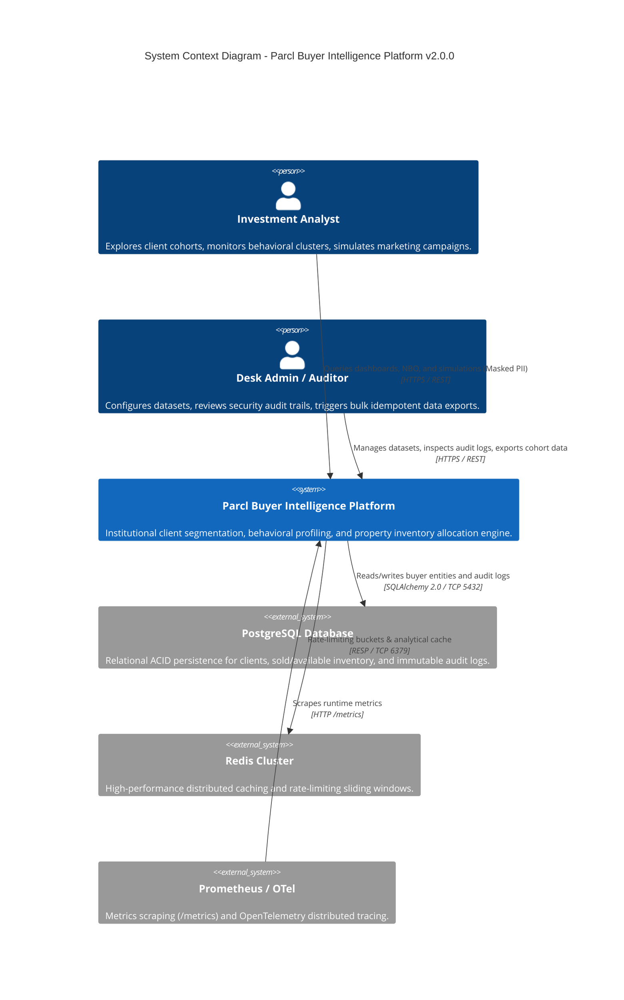
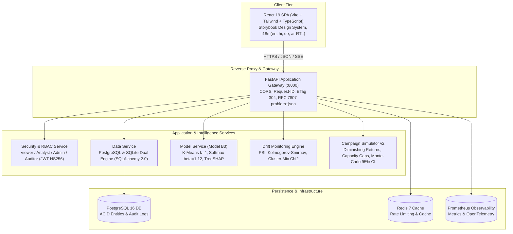

# Architecture & System Design (C4 Model)

```mermaid
C4Context
  title System Context Diagram - Parcl Buyer Intelligence Platform v2.0.0

  Person(analyst, "Investment Analyst", "Explores client cohorts, monitors behavioral clusters, simulates marketing campaigns.")
  Person(admin, "Desk Admin / Auditor", "Configures datasets, reviews security audit trails, triggers bulk idempotent data exports.")

  System(parcl, "Parcl Buyer Intelligence Platform", "Institutional client segmentation, behavioral profiling, and property inventory allocation engine.")

  System_Ext(postgres, "PostgreSQL Database", "Relational ACID persistence for clients, sold/available inventory, and immutable audit logs.")
  System_Ext(redis, "Redis Cluster", "High-performance distributed caching and rate-limiting sliding windows.")
  System_Ext(prometheus, "Prometheus / OTel", "Metrics scraping (/metrics) and OpenTelemetry distributed tracing.")

  Rel(analyst, parcl, "Queries dashboards, NBO, and simulations (Masked PII)", "HTTPS / REST")
  Rel(admin, parcl, "Manages datasets, inspects audit logs, exports cohort data", "HTTPS / REST")
  Rel(parcl, postgres, "Reads/writes buyer entities and audit logs", "SQLAlchemy 2.0 / TCP 5432")
  Rel(parcl, redis, "Rate-limiting buckets & analytical cache", "RESP / TCP 6379")
  Rel(prometheus, parcl, "Scrapes runtime metrics", "HTTP /metrics")
```

## Container Diagram (C4 Level 2)

```mermaid
graph TD
  subgraph Client Tier
    Browser["React 19 SPA (Vite + Tailwind + TypeScript)<br/>Storybook Design System, i18n (en, hi, de, ar-RTL)"]
  end

  subgraph Reverse Proxy & Gateway
    Proxy["FastAPI Application Gateway (:8000)<br/>CORS, Request-ID, ETag 304, RFC 7807 problem+json"]
  end

  subgraph Application & Intelligence Services
    AuthSvc["Security & RBAC Service<br/>Viewer / Analyst / Admin / Auditor (JWT HS256)"]
    DataSvc["Data Service<br/>PostgreSQL & SQLite Dual Engine (SQLAlchemy 2.0)"]
    ModelSvc["Model Service (Model B3)<br/>K-Means k=4, Softmax beta=1.12, TreeSHAP"]
    DriftSvc["Drift Monitoring Engine<br/>PSI, Kolmogorov-Smirnov, Cluster-Mix Chi2"]
    SimSvc["Campaign Simulator v2<br/>Diminishing Returns, Capacity Caps, Monte-Carlo 95% CI"]
  end

  subgraph Persistence & Infrastructure
    PostgresDB[("PostgreSQL 16 DB<br/>ACID Entities & Audit Logs")]
    RedisStore[("Redis 7 Cache<br/>Rate Limiting & Cache")]
    Prom[("Prometheus Observability<br/>Metrics & OpenTelemetry")]
  end

  Browser -->|HTTPS / JSON / SSE| Proxy
  Proxy --> AuthSvc
  Proxy --> DataSvc
  Proxy --> ModelSvc
  Proxy --> DriftSvc
  Proxy --> SimSvc

  DataSvc --> PostgresDB
  Proxy --> RedisStore
  Proxy --> Prom
```
